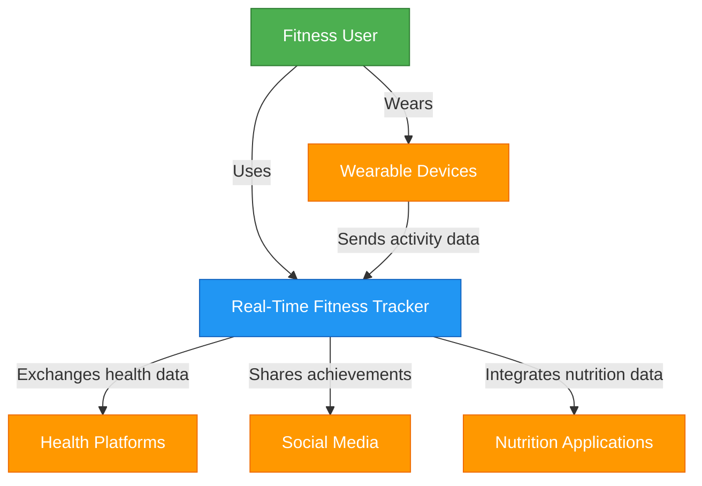
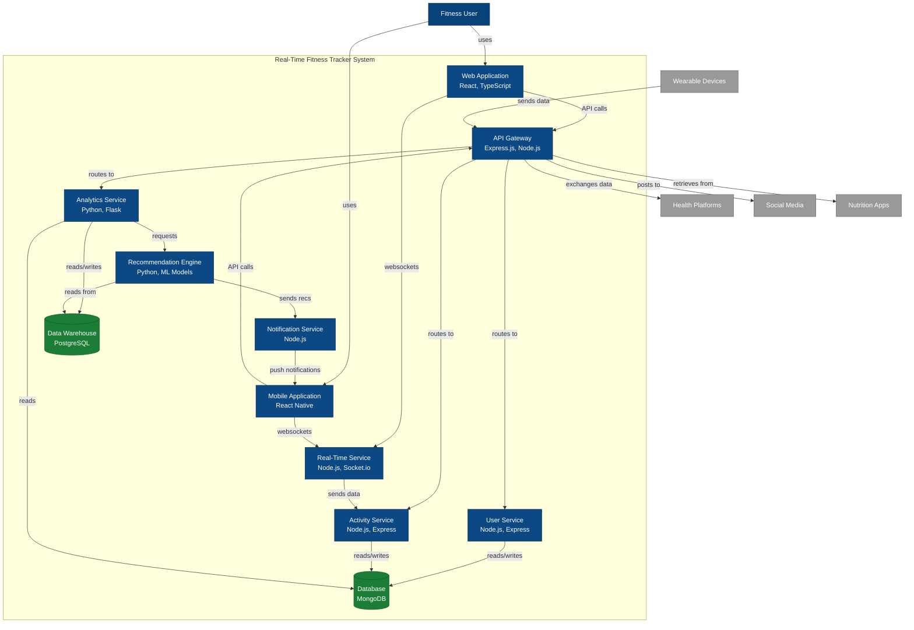

    ```mermaid
    flowchart TD
    subgraph ActivityService["Activity Service"]
        ActivityController["Activity Controller\nExpress Router"]
        ActivityManager["Activity Manager\nTypeScript"]
        WorkoutProcessor["Workout Processor\nTypeScript"]
        GoalTracker["Goal Tracker\nTypeScript"]
        MetricCalculator["Metric Calculator\nTypeScript"]
        DeviceConnector["Device Connector\nTypeScript"]
        DataValidator["Data Validator\nTypeScript"]
        ActivityRepo["Activity Repository\nTypeScript"]
        GoalRepo["Goal Repository\nTypeScript"]
        EventEmitter["Event Emitter\nTypeScript"]
    end
    
    Database[(Database\nMongoDB)]
    RealTimeService["Real-Time Service"]
    APIGateway["API Gateway"]
    NotificationService["Notification Service"]
    
    APIGateway -->|REST| ActivityController
    ActivityController --> ActivityManager
    
    ActivityManager --> WorkoutProcessor
    ActivityManager --> GoalTracker
    ActivityManager --> MetricCalculator
    
    WorkoutProcessor --> DeviceConnector
    DeviceConnector --> DataValidator
    
    ActivityManager --> ActivityRepo
    GoalTracker --> GoalRepo
    
    ActivityRepo -->|reads/writes| Database
    GoalRepo -->|reads/writes| Database
    
    GoalTracker --> EventEmitter
    ActivityManager --> EventEmitter
    
    EventEmitter -->|events| RealTimeService
    EventEmitter -->|notifications| NotificationService
    
    style ActivityController fill:#555555,stroke:#333333,color:#fff
    style ActivityManager fill:#555555,stroke:#333333,color:#fff
    style WorkoutProcessor fill:#555555,stroke:#333333,color:#fff
    style GoalTracker fill:#555555,stroke:#333333,color:#fff
    style MetricCalculator fill:#555555,stroke:#333333,color:#fff
    style DeviceConnector fill:#555555,stroke:#333333,color:#fff
    style DataValidator fill:#555555,stroke:#333333,color:#fff
    style ActivityRepo fill:#555555,stroke:#333333,color:#fff
    style GoalRepo fill:#555555,stroke:#333333,color:#fff
    style EventEmitter fill:#555555,stroke:#333333,color:#fff
    style RealTimeService fill:#999999,stroke:#6B6B6B,color:#fff
    style APIGateway fill:#999999,stroke:#6B6B6B,color:#fff
    style NotificationService fill:#999999,stroke:#6B6B6B,color:#fff
    style Database fill:#1C7D36,stroke:#13591F,color:#fff
 ```

    # Architectural Design

## C4 Model Diagrams

### 1. Context Diagram

[C4 Context Diagram showing the system and its interactions with users, wearable devices, and external systems]

The Context Diagram illustrates how the Real-Time Fitness Tracker interacts with:
- Fitness Users who directly use the system
- Wearable Devices that provide fitness data
- External Health Platforms for data exchange
- Social Media Platforms for sharing achievements
- Nutrition Applications for integrated health tracking

### 2. Container Diagram

[C4 Container Diagram showing the high-level technical components of the system]

The Container Diagram breaks down the system into its major components:
- Web Application: Browser-based interface for users
- Mobile Application: Native mobile interface for iOS and Android
- API Gateway: Central entry point for all client requests
- Real-Time Service: Manages websocket connections for live updates
- User Service: Handles authentication and user management
- Activity Service: Processes fitness activities and workouts
- Analytics Service: Analyzes user performance data
- Recommendation Engine: Generates personalized fitness suggestions
- Notification Service: Manages user alerts and reminders
- Database: Stores user data, activities, and metrics
- Data Warehouse: Stores historical data for analysis

### 3. Component Diagram for Activity Service

[C4 Component Diagram showing the detailed components of the Activity Service]

The Component Diagram for the Activity Service illustrates its internal structure:
- Activity Controller: Handles HTTP requests
- Activity Manager: Core business logic
- Workout Processor: Validates and processes workouts
- Goal Tracker: Monitors progress toward fitness goals
- Metric Calculator: Derives fitness metrics from raw data
- Device Connector: Interfaces with different wearable devices
- Data Validator: Ensures data quality and integrity
- Activity Repository: Data access for activity records
- Goal Repository: Data access for user goals
- Event Emitter: Publishes events to other system components

### 4. End-to-End Components

The system architecture ensures end-to-end functionality through:

1. **Data Collection Layer**
   - Wearable device integration
   - Manual activity input
   - Third-party API connections

2. **Data Processing Layer**
   - Real-time data validation
   - Metric calculation
   - Data transformation

3. **Business Logic Layer**
   - Activity management
   - Goal tracking
   - User profile management
   - Recommendation generation

4. **Presentation Layer**
   - Web interface
   - Mobile application
   - Notification system
   - Data visualization

5. **Integration Layer**
   - Health platform connections
   - Social media sharing
   - Nutrition app integration

6. **Data Storage Layer**
   - User profile database
   - Activity and metrics database
   - Historical data warehouse
   - Caching system
    


    
