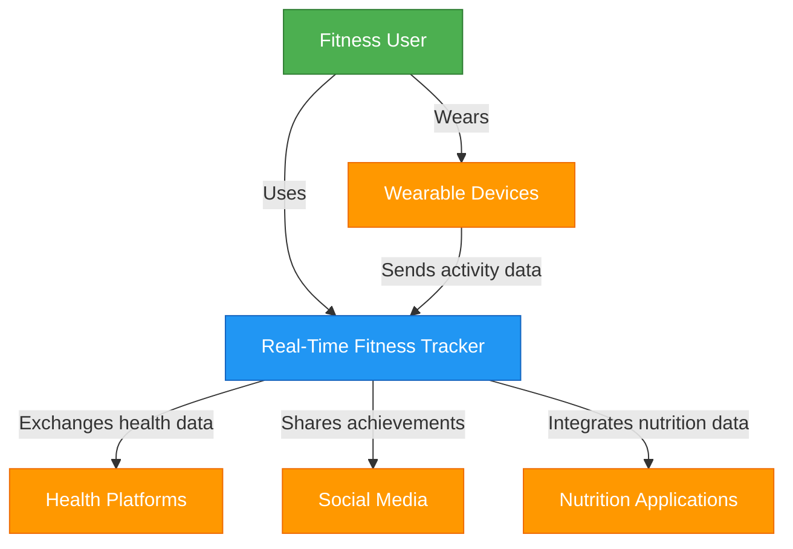

    '''mermaid
     classDef person fill:#4CAF50,stroke:#2E7D32,color:#fff
    classDef container fill:#2196F3,stroke:#1565C0,color:#fff
    classDef database fill:#9C27B0,stroke:#6A1B9A,color:#fff
    classDef external fill:#FF9800,stroke:#EF6C00,color:#fff
    
    class User person
    class WebApp,MobileApp,APIGateway,RealTimeService,UserService,ActivityService,AnalyticsService,RecommendationEngine,NotificationService container
    class Database,DataWarehouse database
    class Wearables,HealthAPIs,SocialMedia,NutritionApps external

    '''

    '''mermaid
    C4Component
    title Component diagram for Activity Service

    Container_Boundary(activityService, "Activity Service") {
        Component(activityController, "Activity Controller", "Express Router", "Handles HTTP requests related to activities and workouts")
        Component(activityManager, "Activity Manager", "TypeScript", "Business logic for processing activity data")
        Component(workoutProcessor, "Workout Processor", "TypeScript", "Processes and validates workout data")
        Component(goalTracker, "Goal Tracker", "TypeScript", "Tracks user progress toward fitness goals")
        Component(metricCalculator, "Metric Calculator", "TypeScript", "Calculates derived metrics from raw activity data")
        Component(deviceConnector, "Device Connector", "TypeScript", "Handles data from various wearable devices")
        Component(dataValidator, "Data Validator", "TypeScript", "Validates incoming fitness data")
        Component(activityRepository, "Activity Repository", "TypeScript", "Data access layer for activity data")
        Component(goalRepository, "Goal Repository", "TypeScript", "Data access layer for goal data")
        Component(eventEmitter, "Event Emitter", "TypeScript", "Publishes events to the message queue")
    }
    
    ContainerDb(database, "Database", "MongoDB", "Stores user activities and goals")
    Container(realTimeService, "Real-Time Service", "Node.js", "Distributes real-time updates")
    Container(apiGateway, "API Gateway", "Express.js", "Routes API requests")
    Container(notificationService, "Notification Service", "Node.js", "Sends notifications")
    
    Rel(apiGateway, activityController, "Sends activity requests to", "REST")
    Rel(activityController, activityManager, "Uses")
    Rel(activityManager, workoutProcessor, "Uses")
    Rel(activityManager, goalTracker, "Uses")
    Rel(activityManager, metricCalculator, "Uses")
    Rel(workoutProcessor, deviceConnector, "Uses")
    Rel(deviceConnector, dataValidator, "Uses")
    Rel(activityManager, activityRepository, "Uses")
    Rel(goalTracker, goalRepository, "Uses")
    Rel(activityRepository, database, "Reads from and writes to", "MongoDB Driver")
    Rel(goalRepository, database, "Reads from and writes to", "MongoDB Driver")
    Rel(goalTracker, eventEmitter, "Publishes goal events to")
    Rel(activityManager, eventEmitter, "Publishes activity events to")
    Rel(eventEmitter, realTimeService, "Sends events to", "Message Queue")
    Rel(eventEmitter, notificationService, "Sends achievement notifications to", "Message Queue")
    '''

    # Architectural Design

## C4 Model Diagrams

### 1. Context Diagram

[C4 Context Diagram showing the system and its interactions with users, wearable devices, and external systems]

The Context Diagram illustrates how the Real-Time Fitness Tracker interacts with:
- Fitness Users who directly use the system
- Wearable Devices that provide fitness data
- External Health Platforms for data exchange
- Social Media Platforms for sharing achievements
- Nutrition Applications for integrated health tracking

### 2. Container Diagram

[C4 Container Diagram showing the high-level technical components of the system]

The Container Diagram breaks down the system into its major components:
- Web Application: Browser-based interface for users
- Mobile Application: Native mobile interface for iOS and Android
- API Gateway: Central entry point for all client requests
- Real-Time Service: Manages websocket connections for live updates
- User Service: Handles authentication and user management
- Activity Service: Processes fitness activities and workouts
- Analytics Service: Analyzes user performance data
- Recommendation Engine: Generates personalized fitness suggestions
- Notification Service: Manages user alerts and reminders
- Database: Stores user data, activities, and metrics
- Data Warehouse: Stores historical data for analysis

### 3. Component Diagram for Activity Service

[C4 Component Diagram showing the detailed components of the Activity Service]

The Component Diagram for the Activity Service illustrates its internal structure:
- Activity Controller: Handles HTTP requests
- Activity Manager: Core business logic
- Workout Processor: Validates and processes workouts
- Goal Tracker: Monitors progress toward fitness goals
- Metric Calculator: Derives fitness metrics from raw data
- Device Connector: Interfaces with different wearable devices
- Data Validator: Ensures data quality and integrity
- Activity Repository: Data access for activity records
- Goal Repository: Data access for user goals
- Event Emitter: Publishes events to other system components

### 4. End-to-End Components

The system architecture ensures end-to-end functionality through:

1. **Data Collection Layer**
   - Wearable device integration
   - Manual activity input
   - Third-party API connections

2. **Data Processing Layer**
   - Real-time data validation
   - Metric calculation
   - Data transformation

3. **Business Logic Layer**
   - Activity management
   - Goal tracking
   - User profile management
   - Recommendation generation

4. **Presentation Layer**
   - Web interface
   - Mobile application
   - Notification system
   - Data visualization

5. **Integration Layer**
   - Health platform connections
   - Social media sharing
   - Nutrition app integration

6. **Data Storage Layer**
   - User profile database
   - Activity and metrics database
   - Historical data warehouse
   - Caching system
    

    
