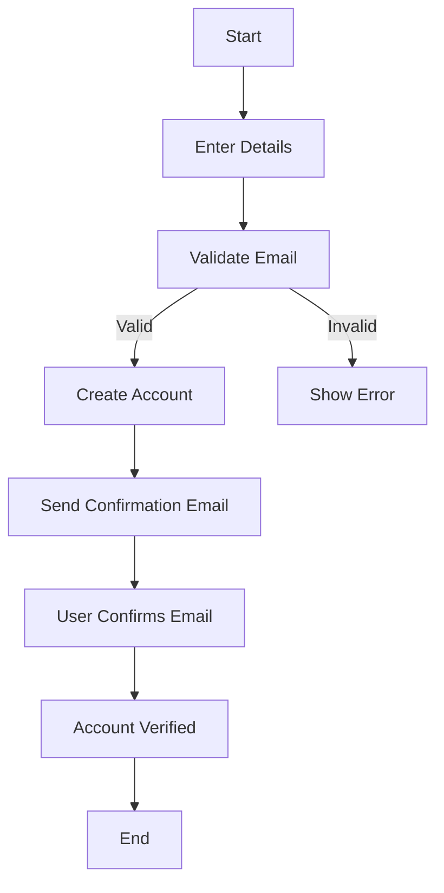

```mermaid

graph TD
    A[Start] --> B[Enter Details]
    B --> C[Validate Email]
    C -->|Valid| D[Create Account]
    C -->|Invalid| E[Show Error]
    D --> F[Send Confirmation Email]
    F --> G[User Confirms Email]
    G --> H[Account Verified]
    H --> I[End]

```
