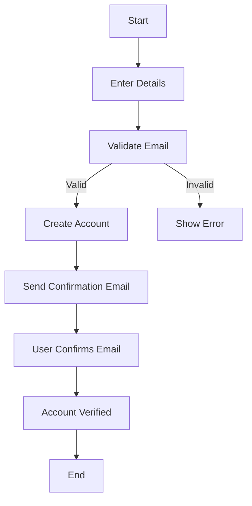
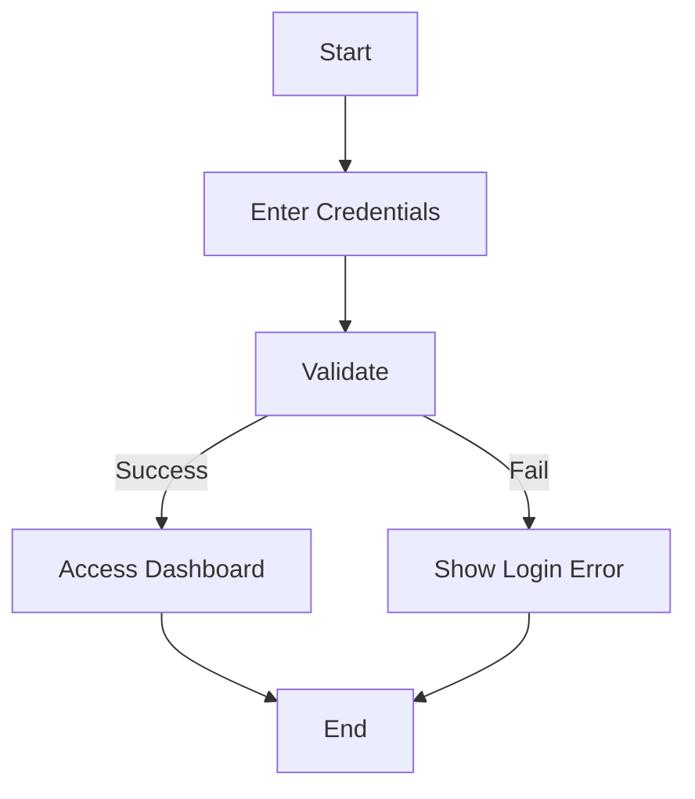
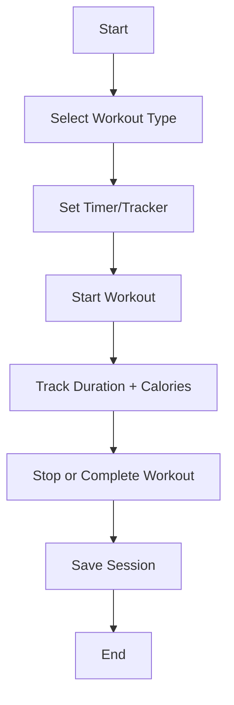
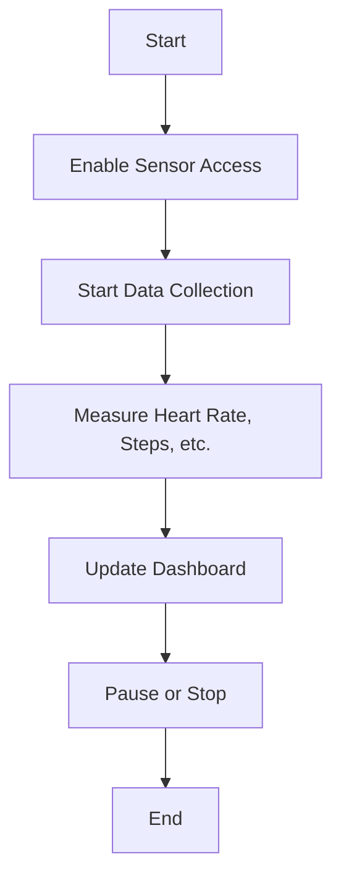
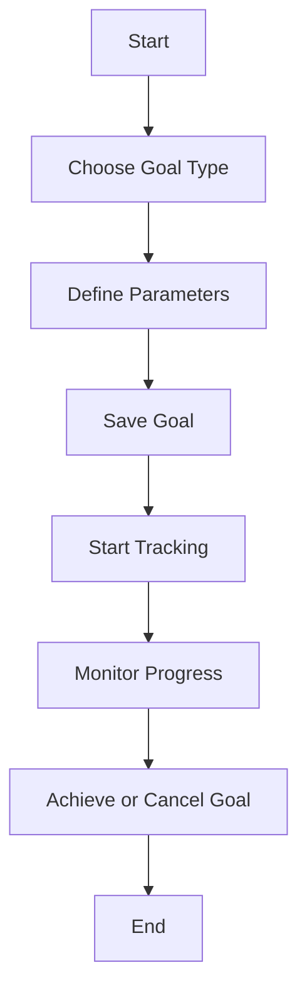
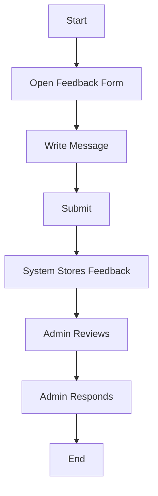
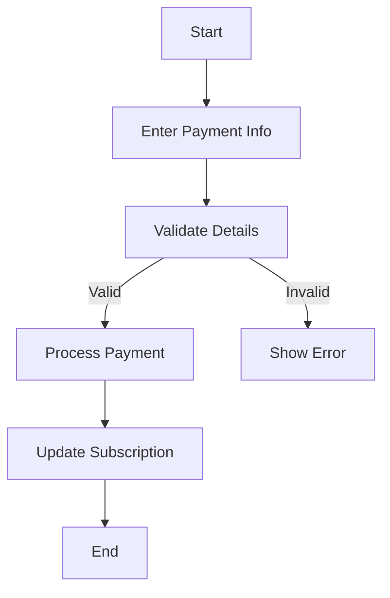
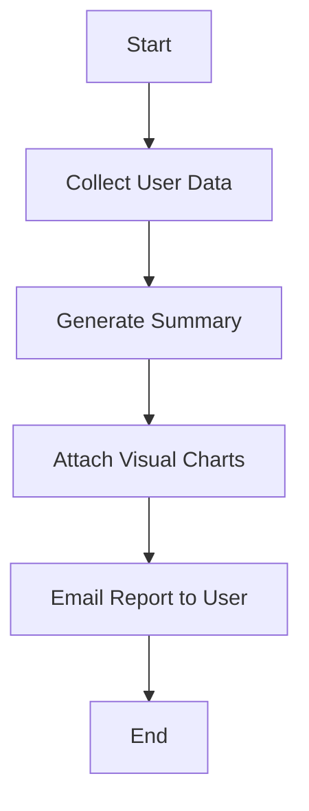

```mermaid

graph TD
    A[Start] --> B[Enter Details]
    B --> C[Validate Email]
    C -->|Valid| D[Create Account]
    C -->|Invalid| E[Show Error]
    D --> F[Send Confirmation Email]
    F --> G[User Confirms Email]
    G --> H[Account Verified]
    H --> I[End]

```

```mermaid

graph TD
    A[Start] --> B[Enter Credentials]
    B --> C[Validate]
    C -->|Success| D[Access Dashboard]
    C -->|Fail| E[Show Login Error]
    D --> F[End]
    E --> F
```

```mermaid

graph TD
    A[Start] --> B[Select Workout Type]
    B --> C[Set Timer/Tracker]
    C --> D[Start Workout]
    D --> E[Track Duration + Calories]
    E --> F[Stop or Complete Workout]
    F --> G[Save Session]
    G --> H[End]
```

```mermaid

graph TD
    A[Start] --> B[Enable Sensor Access]
    B --> C[Start Data Collection]
    C --> D[Measure Heart Rate, Steps, etc.]
    D --> E[Update Dashboard]
    E --> F[Pause or Stop]
    F --> G[End]

```

```mermaid

graph TD
    A[Start] --> B[Choose Goal Type]
    B --> C[Define Parameters]
    C --> D[Save Goal]
    D --> E[Start Tracking]
    E --> F[Monitor Progress]
    F --> G[Achieve or Cancel Goal]
    G --> H[End]
```

```mermaid

graph TD
    A[Start] --> B[Open Feedback Form]
    B --> C[Write Message]
    C --> D[Submit]
    D --> E[System Stores Feedback]
    E --> F[Admin Reviews]
    F --> G[Admin Responds]
    G --> H[End]
```

```mermaid

graph TD
    A[Start] --> B[Enter Payment Info]
    B --> C[Validate Details]
    C -->|Valid| D[Process Payment]
    C -->|Invalid| E[Show Error]
    D --> F[Update Subscription]
    F --> G[End]
```

```mermaid

graph TD
    A[Start] --> B[Collect User Data]
    B --> C[Generate Summary]
    C --> D[Attach Visual Charts]
    D --> E[Email Report to User]
    E --> F[End]
```

