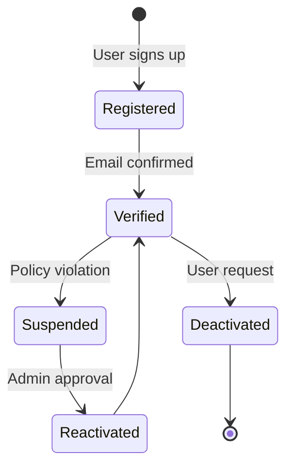
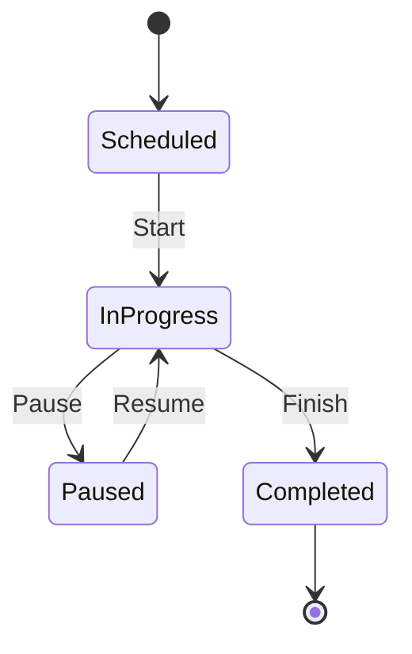
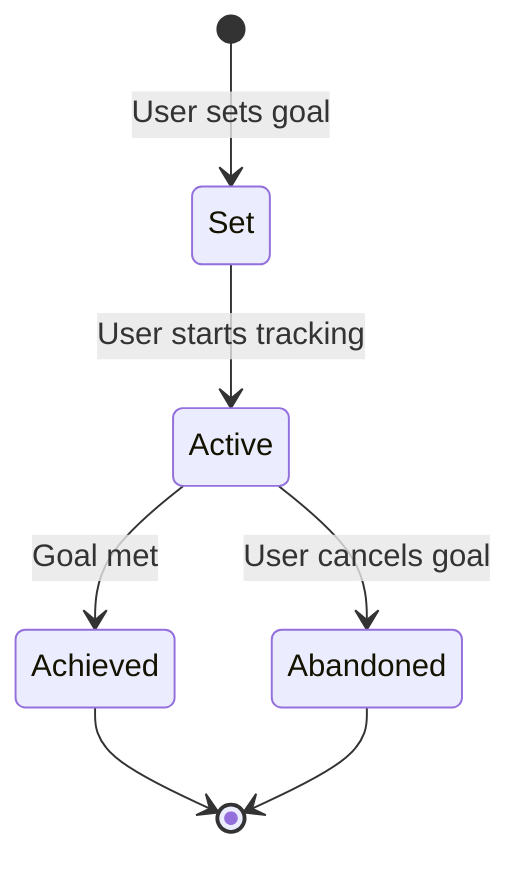
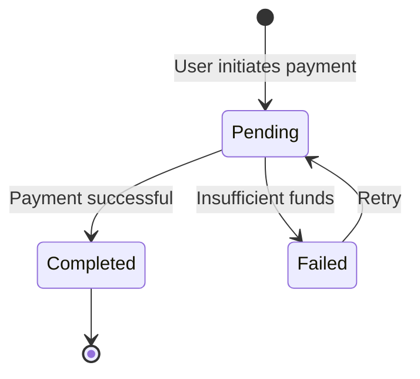
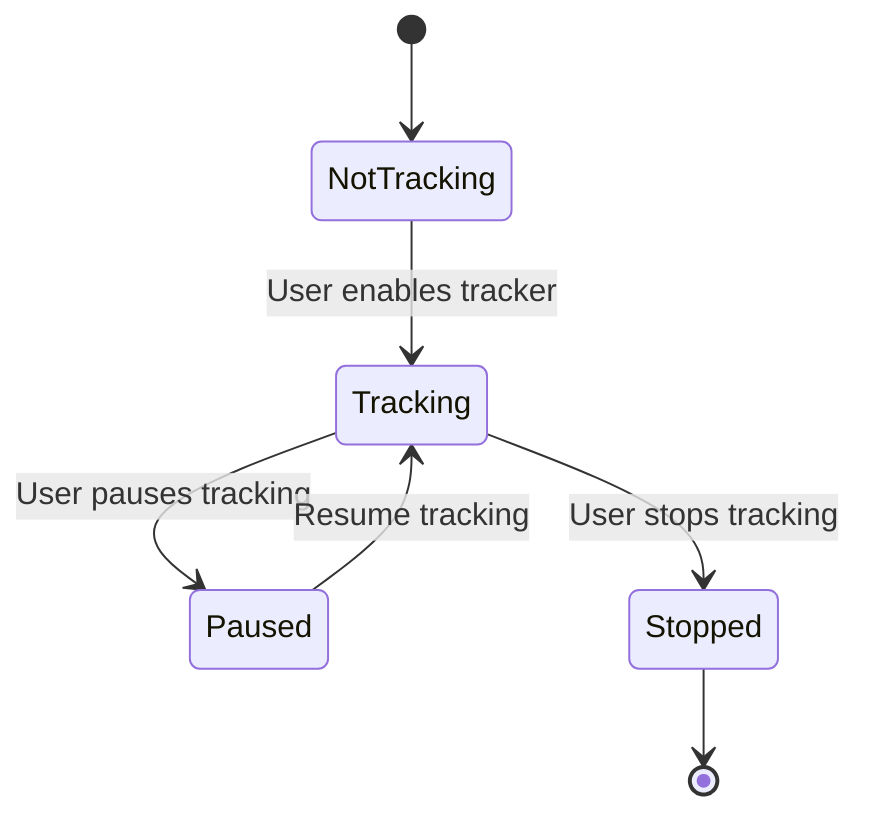

```mermaid
stateDiagram-v2
    [*] --> Registered : User signs up
    Registered --> Verified : Email confirmed
    Verified --> Suspended : Policy violation
    Verified --> Deactivated : User request
    Suspended --> Reactivated : Admin approval
    Deactivated --> [*]
    Reactivated --> Verified


```

```mermaid
stateDiagram
    [*] --> Scheduled
    Scheduled --> InProgress : Start
    InProgress --> Paused : Pause
    Paused --> InProgress : Resume
    InProgress --> Completed : Finish
    Completed --> [*]
```

```mermaid
stateDiagram-v2
    [*] --> Set : User sets goal
    Set --> Active : User starts tracking
    Active --> Achieved : Goal met
    Active --> Abandoned : User cancels goal
    Achieved --> [*]
    Abandoned --> [*]


```

```mermaid
stateDiagram-v2
    [*] --> Pending : User initiates payment
    Pending --> Completed : Payment successful
    Pending --> Failed : Insufficient funds
    Failed --> Pending : Retry
    Completed --> [*]
```

```mermaid

stateDiagram-v2
    [*] --> NotTracking
    NotTracking --> Tracking : User enables tracker
    Tracking --> Paused : User pauses tracking
    Paused --> Tracking : Resume tracking
    Tracking --> Stopped : User stops tracking
    Stopped --> [*]

```

