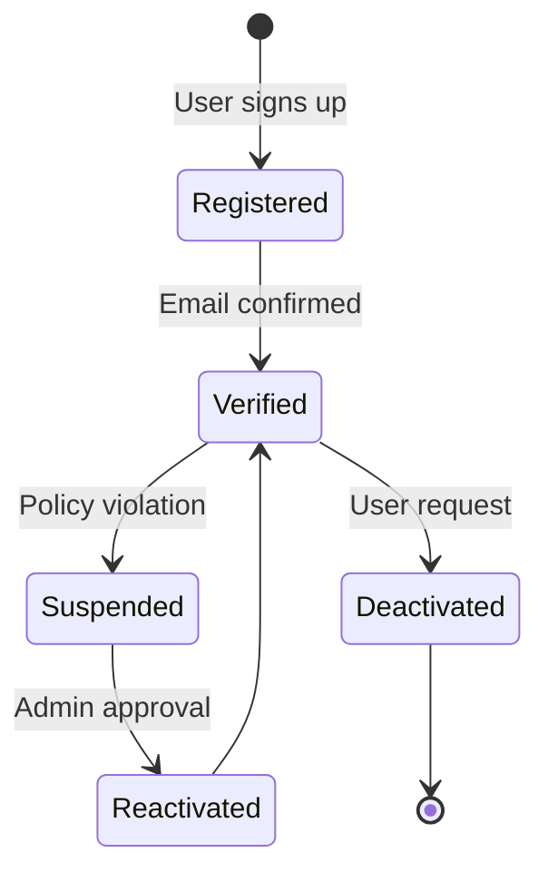
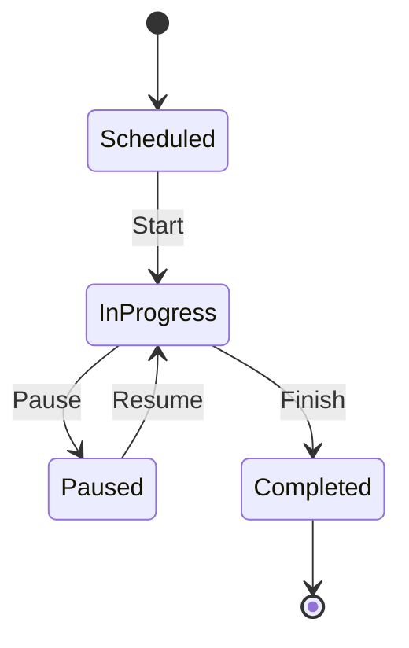
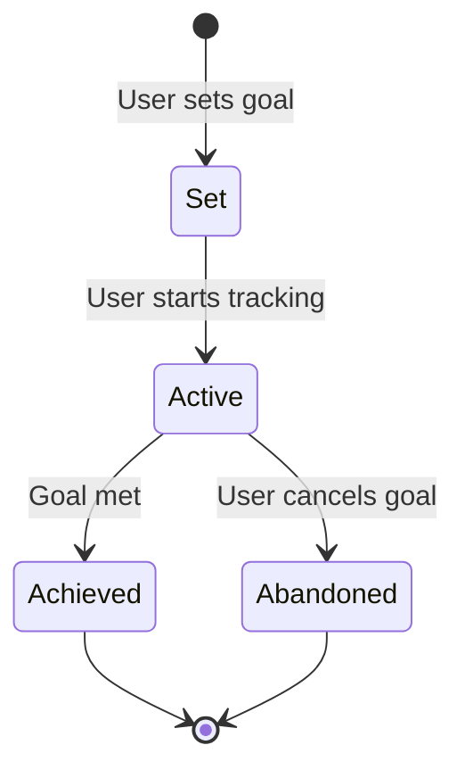
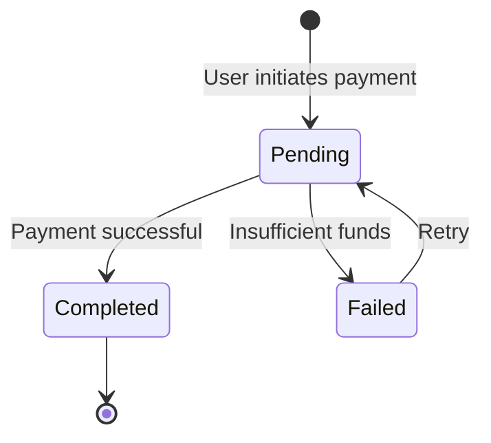
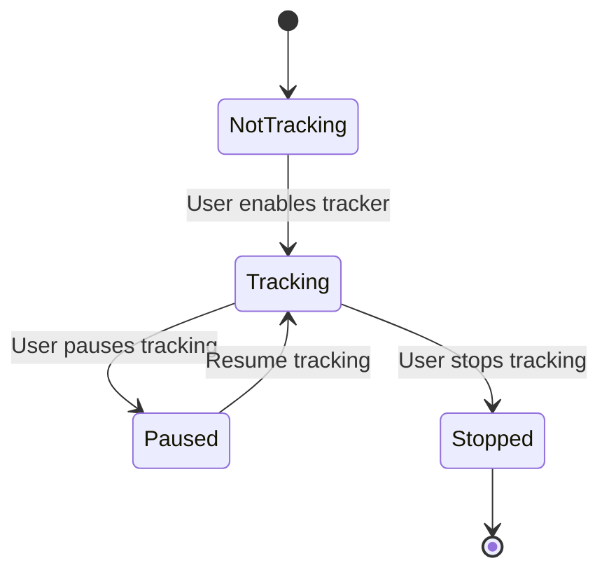
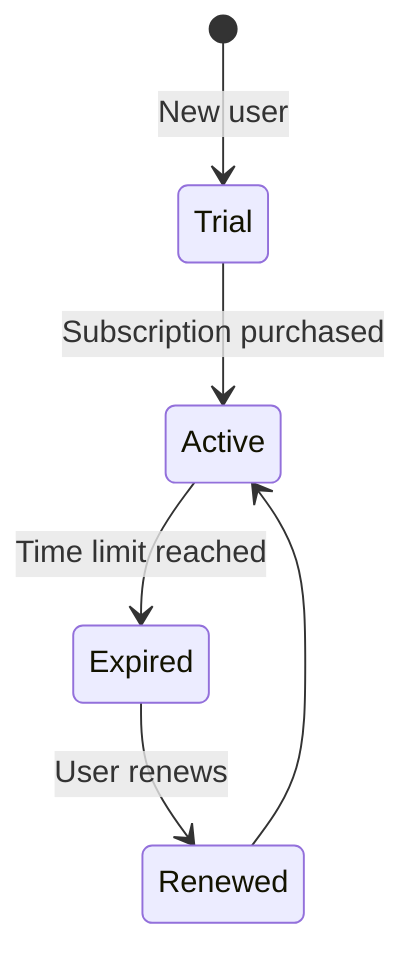
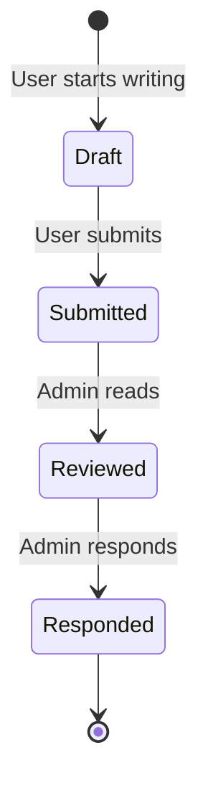

```mermaid
stateDiagram-v2
    [*] --> Registered : User signs up
    Registered --> Verified : Email confirmed
    Verified --> Suspended : Policy violation
    Verified --> Deactivated : User request
    Suspended --> Reactivated : Admin approval
    Deactivated --> [*]
    Reactivated --> Verified


```

```mermaid
stateDiagram
    [*] --> Scheduled
    Scheduled --> InProgress : Start
    InProgress --> Paused : Pause
    Paused --> InProgress : Resume
    InProgress --> Completed : Finish
    Completed --> [*]
```

```mermaid
stateDiagram-v2
    [*] --> Set : User sets goal
    Set --> Active : User starts tracking
    Active --> Achieved : Goal met
    Active --> Abandoned : User cancels goal
    Achieved --> [*]
    Abandoned --> [*]


```

```mermaid
stateDiagram-v2
    [*] --> Pending : User initiates payment
    Pending --> Completed : Payment successful
    Pending --> Failed : Insufficient funds
    Failed --> Pending : Retry
    Completed --> [*]
```

```mermaid

stateDiagram-v2
    [*] --> NotTracking
    NotTracking --> Tracking : User enables tracker
    Tracking --> Paused : User pauses tracking
    Paused --> Tracking : Resume tracking
    Tracking --> Stopped : User stops tracking
    Stopped --> [*]

```

```mermaid

stateDiagram-v2
    [*] --> Trial : New user
    Trial --> Active : Subscription purchased
    Active --> Expired : Time limit reached
    Expired --> Renewed : User renews
    Renewed --> Active
```

```mermaid

stateDiagram-v2
    [*] --> Draft : User starts writing
    Draft --> Submitted : User submits
    Submitted --> Reviewed : Admin reads
    Reviewed --> Responded : Admin responds
    Responded --> [*]

```
